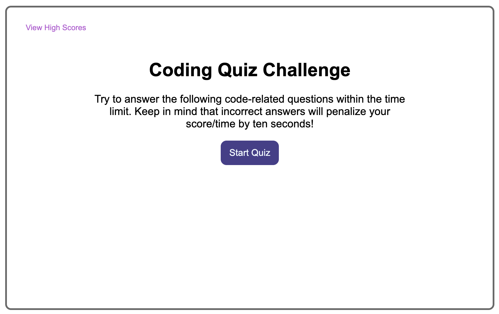

# Coding Quiz

### **Short Dynamic JavaScript Coding Quiz**

[Coding Quiz Link](https://jweibelbootcamp.github.io/Coding-Quiz//)

### **Description**
* The is a short Coding Quiz to test JavaScript knowledge. Click the button to start the quiz and a 50 second timer will begin. Wrong answers penalize you 10 seconds.  Your final score is the remaining time after all questions are answered. Enter your initials and click the button to save them to the High Score Board. Click Go Back to start again.  Click the High Scores text to view High Scores at any time. 

### **Technologies Used**
* HTML
* CSS
* JavaScript

### **Setup/Installation Instructions**
* N/A

### **Known Bugs**
* None 

### **License**
* MIT  
* Copyright (c) 2022 Jason Weibel